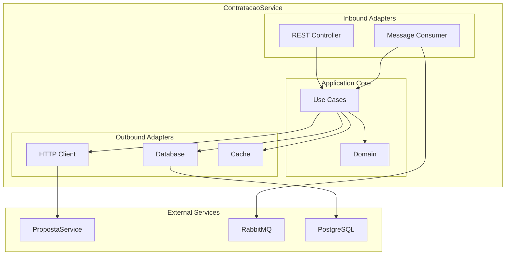

# ContratacaoService

[](https://dotnet.microsoft.com/)
[](https://www.docker.com/)
[](https://en.wikipedia.org/wiki/Hexagonal_architecture_(software))

Microserviço responsável por processar contratações baseadas em propostas aprovadas, implementado com **Arquitetura Hexagonal** (Ports and Adapters) e **.NET 8**.

## 1 Arquitetura



## 2 Início Rápido

### Opção 1: Script PowerShell (Recomendado)

Para facilitar o início, use o script PowerShell que valida a rede Docker e inicia o serviço automaticamente.

```powershell
.\scripts\start-with-network-validation.ps1
```

### Opção 2: Docker Compose

Caso prefira, é possível iniciar o serviço manualmente utilizando Docker Compose.

```bash
# Criar rede externa (uma vez apenas)
docker network create propostaservice_microservices-network

# Iniciar serviço
docker-compose up -d
```

### Opção 3: Desenvolvimento Local

Para desenvolvimento, você pode usar a infraestrutura padrão do Docker e executar a aplicação localmente.

```bash
# Usar apenas infraestrutura Docker
docker-compose up -d postgres rabbitmq

# Executar aplicação localmente
dotnet run
```

## 3 Endpoints

| Método | Endpoint | Descrição |
|--------|----------|-----------|
| `POST` | `/api/contratacoes` | Solicitar nova contratação |
| `GET` | `/api/contratacoes/{id}` | Consultar contratação por ID |

### Exemplo de Uso

```bash
# Solicitar contratação
curl -X POST http://localhost:5002/api/contratacoes \
  -H "Content-Type: application/json" \
  -d '{"propostaId": "50bb7eda-c79a-4c47-8c6e-d0c557467d42"}'

# Consultar contratação
curl http://localhost:5002/api/contratacoes/{id}
```

## 4 Integração com Microserviços

### RabbitMQ (Eventos)
- **Exchange**: `proposta_events`
- **Queue**: `contratacao.propostas.events`
- **Events**:
  - `PropostaAprovadaEvent` ? Atualiza cache em memória, disponibilizando a proposta para contratação.
  - `PropostaRejeitadaEvent` ? Atualiza cache em memória, indisponibilizando a proposta para contratação.

### HTTP (Fallback)
- **PropostaService**: `http://localhost:5000` (dev) / `http://proposta-service:8080` (prod)
- **Endpoint**: `GET /api/Propostas/{id}` ? Consulta status quando cache falha

## 5 Tecnologias

### Core
- **.NET 8** - Framework principal
- **C# 12** - Linguagem de programação
- **Entity Framework Core** - ORM para PostgreSQL
- **ASP.NET Core** - API REST

### Infraestrutura
- **PostgreSQL** - Banco de dados principal
- **RabbitMQ** - Message broker para eventos
- **Docker** - Containerização
- **Swagger/OpenAPI** - Documentação da API

### Padrões e Práticas
- **Arquitetura Hexagonal** - Ports and Adapters
- **Clean Architecture** - Separação de responsabilidades
- **CQRS** - Command Query Responsibility Segregation
- **Event-Driven** - Comunicação via eventos
- **Resilience** - Retry policies e circuit breakers

## 6 Estrutura do Projeto

```
ContratacaoService/
- Application/           # ?? Casos de uso e DTOs
|__ Commands/         # Comandos de entrada
|__ DTOs/            # Data Transfer Objects
|__ Events/          # Eventos de domínio
|__ Ports/           # Interfaces (contratos)
|__ UseCases/        # Lógica de aplicação
|__ Domain/               # ?? Regras de negócio
    |__ Entities/        # Entidades de domínio
    |__ Repositories/    # Contratos de persistência
    |__ ValueObjects/    # Objetos de valor
|__ Infrastructure/       # ?? Implementações técnicas
    |__ Adapters/        # Adaptadores (Inbound/Outbound)
    |__ Cache/           # Implementações de cache
    |__ Configuration/   # Configurações
    |__ Migrations/      # Migrations do EF Core
|__ scripts/             # ?? Scripts de automação
|__ docker-compose.yml   # ?? Configuração Docker
```

## ?? URLs de Acesso

| Serviço | URL | Descrição |
|---------|-----|-----------|
| **API** | http://localhost:5002 | Endpoint principal da API |
| **Swagger** | http://localhost:5002/swagger | Documentação interativa |
| **Database** | localhost:5432 | PostgreSQL (contratacao) |
| **RabbitMQ** | http://localhost:15672 | Management UI (guest/guest) |

## 7 Configuração

### Variáveis de Ambiente (Docker)

As variáveis de ambiente são configuradas no arquivo `docker-compose.yml`. Certifique-se de que estão corretas para o seu ambiente.

```yaml
environment:
  - ASPNETCORE_ENVIRONMENT=Production
  - ConnectionStrings__ContratacaoDb=Host=postgres;Port=5432;Database=contratacao;Username=postgres;Password=postgres
  - PropostaService__BaseUrl=http://proposta-service:8080
  - RabbitMQ__Host=rabbitmq
  - RabbitMQ__Exchange=proposta_events
  - RabbitMQ__Queue=contratacao.propostas.events
```

### Configuração Local (Development)

Para configurar o projeto para desenvolvimento local, edite o arquivo `appsettings.Development.json` com as informações do seu ambiente.

```json
{
  "ConnectionStrings": {
    "ContratacaoDb": "Host=localhost;Port=5432;Database=propostadb;Username=postgres;Password=postgres"
  },
  "PropostaService": {
    "BaseUrl": "http://localhost:5000"
  },
  "RabbitMQ": {
    "Host": "localhost",
    "Exchange": "proposta_events",
    "Queue": "contratacao.propostas.events"
  }
}
```

## 8 Comandos Úteis

```bash
# Build e execução
dotnet build
dotnet run

# Docker
docker-compose up -d
docker-compose logs -f contratacao-service
docker-compose down

# Migrations
dotnet ef migrations add NomeDaMigration
dotnet ef database update

# Testes
dotnet test
```

## 9 Licença

Este projeto está sob a licença MIT. Veja o arquivo [LICENSE](LICENSE) para mais detalhes.

## 10 Equipe

- **Desenvolvido por**: Fabio HMS
- **Arquitetura**: Hexagonal (Ports and Adapters)
- **Padrões**: Clean Architecture, CQRS, Event-Driven
- **Data de Criação**: 20/09/2025

---

? **Se este projeto foi útil, considere dar uma estrela!** ?
